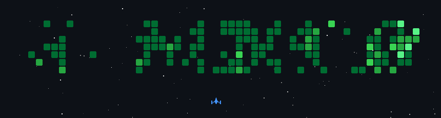

# Mohamed Ali May

<b>Lead Software Engineer</b> Java, Kubernetes and cloud platforms · Tunis

   

I'm a Lead Software Engineer at [MaibornWolff](https://www.maibornwolff.de/en). I've spent 7+ years building cloud-native backend systems, mostly Java and Spring Boot on Kubernetes, and the CI/CD, infrastructure as code and observability that keep them running in production.

These days I'm also building tools for working with AI coding agents, and running the platform behind my coworking space.

### Things I've built

  
  
  

- **[ClaudeWatch](https://github.com/maydali28/claudewatch)**: desktop companion for Claude Code with live cost, token and cache analytics from local session logs. Featured on Product Hunt, 700+ downloads. [Site](https://claudewatch.mohamedalimay.dev) · [Case study](https://www.mohamedalimay.dev/projects/claudewatch)
- **[MemCP](https://github.com/maydali28/memcp)**: persistent memory MCP server for Claude Code, so context survives `/compact` and new sessions. 458 tests, on PyPI. [PyPI](https://pypi.org/project/claude-memory-mcp/) · [Case study](https://www.mohamedalimay.dev/projects/memcp)
- **Hyperspace**: the platform that runs my coworking space in Bizerte, with public booking, a staff back office, billing and CRM. [Live](https://booking.hscowork.com) · [Case study](https://www.mohamedalimay.dev/projects/hyperspace)

### Latest writing

<!-- BLOG-POST-LIST:START -->
- [From Dumb Devices to Digital Teammates: How Agentic AI is Revolutionizing the Internet of Things](https://faun.pub/from-dumb-devices-to-digital-teammates-how-agentic-ai-is-revolutionizing-the-internet-of-things-e4342bcf3ead)
- [Solving Claude's Amnesia: Building Persistent Memory with MCP](https://medium.com/@dali.may28/solving-claudes-amnesia-building-persistent-memory-with-mcp-9c53a41cd0cf)
<!-- BLOG-POST-LIST:END -->

More on [Medium](https://medium.com/@dali.may28).

### Stack

<b>BACKEND</b> 
   

<b>CLOUD &AMP; PLATFORM</b> 
      

<b>CI/CD</b> 
 

<b>DATA &AMP; MESSAGING</b> 
    

<b>OBSERVABILITY</b> 
 

### Certifications

  
  <b>HashiCorp Certified: Terraform Associate (004)</b> 
  Earned Jun 2026 · <a href="https://www.credly.com/badges/31e58a81-aba3-4d69-933a-a4b70a2dec08/public_url">Verify on Credly</a>
   

  
  <b>AWS Certified Solutions Architect – Associate</b> 
  In progress · exam expected Nov 2026
   

